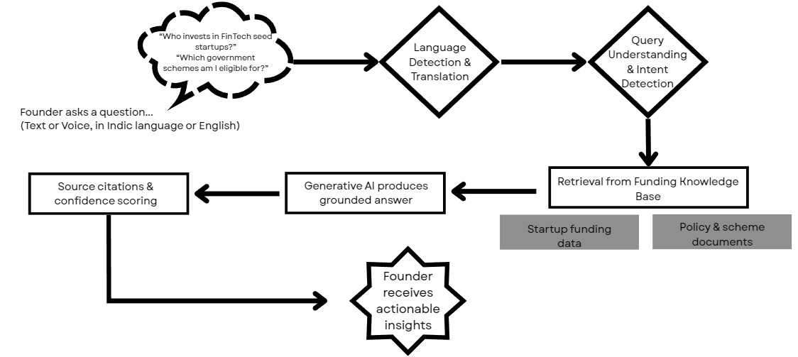
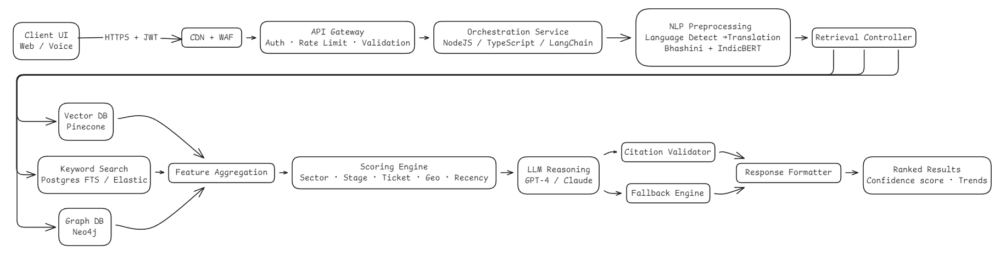

# Funding Copilot (ARGS prototype)

Evidence-first capital matching: founders ask in natural language (English/Indic; future voice), ARGS returns investors and government schemes ranked by fit with transparent scoring and citations.

## Demo
- Prototype walkthrough video: https://drive.google.com/file/d/1M_R_qFoQD4dkIDF0ZcnZc-sUCVVU7rNb/view?usp=sharing

## Unique selling propositions (USPs)
- Grounded answers with source citations to build trust and reduce misinformation.
- Investor matching that explains why each investor is a good fit, not just a search list.
- Indic-first multilingual support so funding intelligence is usable beyond English.
- India-specific context that combines investors, funding trends, and government schemes.


*Four-part USP view showing grounding, fit-based matching, Indic-first reach, and India-specific context.*

## What’s shipped in this repo
- Single-page React + Vite frontend styled with Tailwind and shadcn-style UI primitives (Button, Card, Badge, Input, Select, Textarea, Label).
- Seeded data for investors, schemes, and trend charts in [src/data.js](src/data.js).
- Charting via Chart.js (react-chartjs-2) for trend visualizations.
- Utility helpers in [src/lib/utils.js](src/lib/utils.js) and UI components in [src/components/ui](src/components/ui).

## Frontend feature goals
- Multi-language prompts with detection and future voice input; auto-fill of sector, stage, geography, and ticket size.
- Hybrid results view: ranked investors with rationales + eligible schemes; confidence pill; inline citations; visible trend highs/lows.
- Quick prompts and recent history to guide new queries.
- Dark/light theme via CSS variables.

## How ARGS responds to a query (conceptual flow)
1) Founder asks in text or voice (Indic or English).
2) Language is detected and, if needed, translated.
3) Intent is identified (e.g., investor match or scheme eligibility).
4) Funding knowledge is retrieved and synthesized into a grounded answer.
5) Source citations and confidence scoring are attached so the founder can act.


*High-level flow from question to grounded answer with citations and confidence.*

## Local development
```bash
npm install
npm run dev
```
Defaults to port 5173 (see [vite.config.js](vite.config.js)).

## Build and preview
```bash
npm run build
npm run preview
```

## Project structure
- [src/main.jsx](src/main.jsx) mounts the app and pulls in global styles.
- [src/App.jsx](src/App.jsx) renders the single-page experience.
- [src/data.js](src/data.js) holds mock investors, schemes, and trend data.
- [src/styles.css](src/styles.css) contains Tailwind directives and theme tokens.
- [src/components/ui](src/components/ui) houses shared UI primitives.

## Conceptual architecture snapshot
- Client UI (web/voice) connects over HTTPS with JWT and edge protections (CDN/WAF).
- API gateway handles auth, rate limiting, and validation before orchestrating requests.
- NLP preprocessing covers language detection and translation (Bhashini/IndicBERT).
- Retrieval controller fans out to vector search (Pinecone), keyword search (Postgres FTS/Elastic), and graph context (Neo4j).
- Feature aggregation feeds a scoring engine across sector, stage, ticket, geography, and recency.
- LLM reasoning (GPT-4/Claude) produces rationale with citations; fallback engine provides deterministic answers.
- Citation validator and response formatter return ranked results with confidence and trends.


*Conceptual architecture covering edge protections, orchestration, retrieval, scoring, reasoning, and response formatting.*

## Next steps (suggested)
1) Expand seeded datasets and refine scoring visuals.
2) Add voice capture to the UI and connect to speech processing when available.
3) Implement richer citation display and per-result confidence pills.
4) Introduce telemetry (OTel) and error reporting (Sentry) in the frontend.

## Scripts
- `npm run dev` – start dev server
- `npm run build` – production build
- `npm run preview` – preview built app

## Team
- Gowtham SD
- Shruthi Sivakumar
- Ashwin JR
- Rithesh SS
